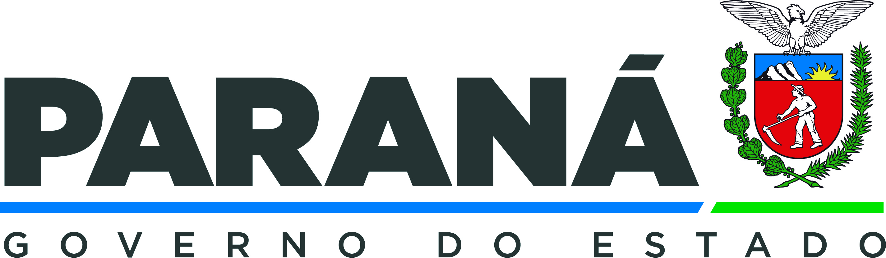

<!-- read me credits: https://gist.github.com/andreasonny83/7670f4b39fe237d52636df3dec49cf3a -->

# CSSPR



## Prerequisites

This project requires NodeJS (version 8 or later) and NPM.
[Node](http://nodejs.org/) and [NPM](https://npmjs.org/) are really easy to install.
To make sure you have them available on your machine,
try running the following command.

```sh
$ npm -v && node -v
6.4.1
v8.16.0
```

## Table of contents

- [CSSPR](#project-name)
  - [Prerequisites](#prerequisites)
  - [Table of contents](#table-of-contents)
  - [Installation](#installation)
  - [Usage](#usage)
    - [Serving the app](#serving-the-server-in-development-mode)
    - [Running the tests](#running-the-tests)
  - [API](#api)
    - [API endpoints](#api-endpoints-test)
      - [Options](#options)
    - [Auth](#auth)
  - [Contributing](#contributing)
  - [Credits](#credits)
  - [Authors](#authors)
  - [License](#license)

## Installation

**BEFORE YOU INSTALL:** please read the [prerequisites](#prerequisites)

Start with cloning this repo on your local machine:

```sh
$ git clone https://github.com/ORG/PROJECT.git
$ cd PROJECT
```

To install and set up the library, run:

```sh
$ npm install
```

Generate database with prisma

```sh
$ npx prima generate
```

## Usage

### Serving the server in development mode

```sh
$ npx nodemon ./server.ts
```

## API

### API endpoints test

We recommend that you make http requests with [Insomnia](https://insomnia.rest/download)

```js
import '/docs/api_Insomnia.json'
```

Check all API endpoints in '/routes/index.ts'

#### Options

Review some validation settings in 'middleware/validator.ts'

Example:

```tsx
export const adminSchema = z.object({
    username: z.string().min(3, { message: "Username must be at least 3 characters long." }),
    password: z.string().min(3, { message: "Password must be at least 3 characters long" }), // Password implement .min(6) in production
    userId: z.string().optional(),
});

// OR
export const adminSchema = z.object({
    // ...
    password: z.string().min(6, { message: "Password must be at least 6 characters long" }), // Some regex validation...
    // ...
});

```

#### AUTH
Make sure to change the secret used in authentication
`/server.ts`
```tsx
// passport middleware
app.use(session({
  secret: "This is a secret",
  resave: false,
  saveUninitialized: false,
  cookie: {
    maxAge: 3600000 // 1 hour
  }
}));
initPassport(app);
```

## Contributing

Please read [CONTRIBUTING.md](CONTRIBUTING.md) for details on our code of conduct, and the process for submitting pull requests to us.

1.  Fork it!
2.  Create your feature branch: `git checkout -b my-new-feature`
3.  Add your changes: `git add .`
4.  Commit your changes: `git commit -am 'Add some feature'`
5.  Push to the branch: `git push origin my-new-feature`
6.  Submit a pull request :sunglasses:

## Credits

This is a fork of [CSSPR](https://github.com/RhianFelipe/ControleSistema)

## Built With

* Node
* Typescript
* Vuejs (Frontend)
* Prisma ORM
* Love <3

## Authors

* **Rhian Felipe** - *Original work/project* - [RhianFelipe](https://github.com/RhianFelipe)

## License

[MIT License](https://andreasonny.mit-license.org/2019) ©Victor Marques